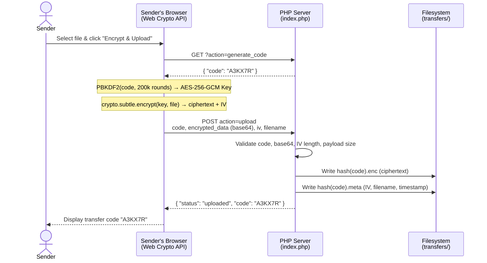
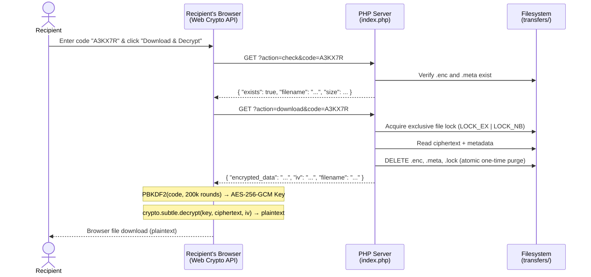
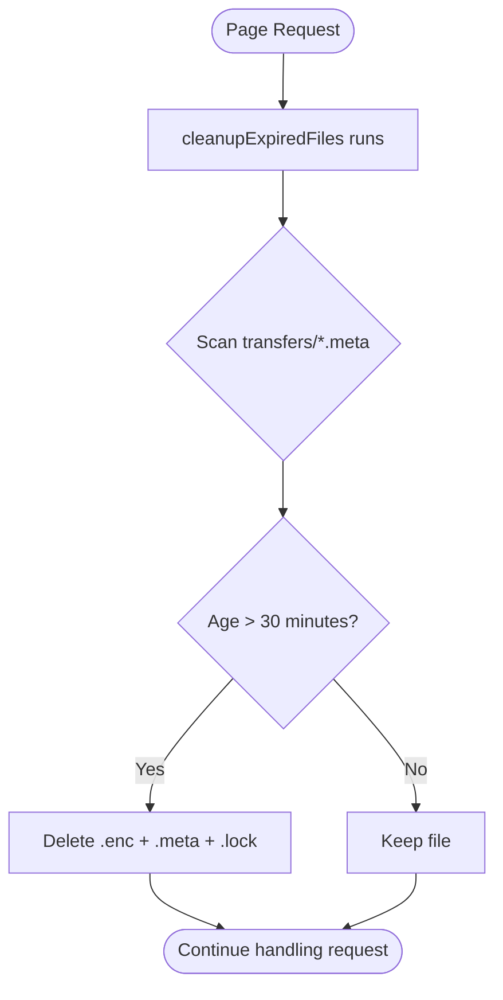
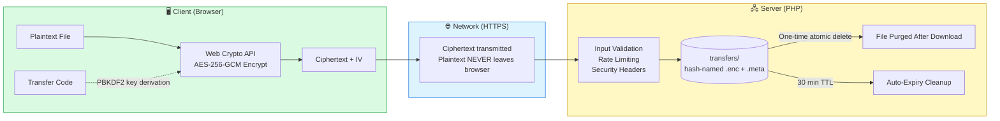

# 🔒 xsukax One-Time E2EE File Transfer

[](https://www.gnu.org/licenses/gpl-3.0)
[](https://www.php.net/)
[](https://en.wikipedia.org/wiki/Galois/Counter_Mode)
[]()

> **End-to-end encrypted, one-time file transfer powered by AES-256-GCM — zero-knowledge, self-destructing, and serverless-key architecture.**

---

## Table of Contents

- [Project Overview](#project-overview)
- [Security & Privacy Benefits](#security--privacy-benefits)
- [Features & Advantages](#features--advantages)
- [Installation Instructions](#installation-instructions)
- [php.ini Configuration](#phpini-configuration)
- [Usage Guide](#usage-guide)
- [Architecture & Diagrams](#architecture--diagrams)
- [File Structure](#file-structure)
- [License](#license)

---

## Project Overview

**xsukax One-Time E2EE File Transfer** is a self-hosted, single-file PHP web application that enables truly private file sharing between parties. Files are encrypted entirely **in the sender's browser** using AES-256-GCM before any data is transmitted to the server. The server never has access to the plaintext file or the encryption key — only opaque ciphertext reaches disk.

Once a recipient enters the 6-character transfer code and downloads the file, it is **immediately and permanently deleted** from the server. If the file is not downloaded within **30 minutes**, it is automatically purged by the cleanup routine. This guarantees a hard, one-time-use delivery model with no residual data left behind.

The entire application ships as a single file — `index.php` — making it trivially easy to self-host on any PHP-capable web server without external dependencies, databases, or package managers.

---

## Security & Privacy Benefits

Security is the core design principle of this application — not an afterthought. Every layer of the stack has been hardened with deliberate, defense-in-depth choices.

### 🔐 Client-Side AES-256-GCM Encryption

All encryption and decryption is performed exclusively in the sender's and recipient's browser using the [Web Crypto API](https://developer.mozilla.org/en-US/docs/Web/API/Web_Crypto_API). The server **never sees plaintext**. The encryption key is derived from the transfer code using **PBKDF2 with 200,000 iterations and SHA-256**, making brute-force attacks computationally prohibitive.

### 🗝️ Zero-Knowledge Architecture

The transfer code acts as the sole key. The server stores only:
- The AES-256-GCM **ciphertext** (`.enc` file)
- The **IV** (initialization vector) and sanitized filename in a metadata file (`.meta`)

The decryption key is never transmitted to, stored on, or derivable by the server. Even a complete server compromise yields only useless ciphertext.

### 💥 Guaranteed One-Time Download

File deletion is enforced using an **exclusive file lock** (`LOCK_EX | LOCK_NB`) before serving the download response. The encrypted file and its metadata are deleted from disk *before* the response is returned to the client, preventing race conditions and ensuring that concurrent download attempts are rejected with a `409 Conflict` error.

### ⏱️ Automatic 30-Minute Expiry

A cleanup routine runs on every page load, scanning all `.meta` files and purging any transfers that have exceeded the 30-minute lifetime (`FILE_LIFETIME = 1800` seconds). Expired files leave no trace.

### 🛡️ Hardened HTTP Security Headers

Every response includes a comprehensive set of security headers:

| Header | Value |
|---|---|
| `Content-Security-Policy` | Restricts all resource origins to `'self'`, preventing XSS and data exfiltration |
| `X-Frame-Options` | `DENY` — prevents clickjacking |
| `X-Content-Type-Options` | `nosniff` — prevents MIME-sniffing attacks |
| `X-XSS-Protection` | `1; mode=block` |
| `Referrer-Policy` | `no-referrer` — suppresses referrer information |
| `Permissions-Policy` | Disables camera, microphone, and geolocation APIs |

### 🚦 IP-Based Rate Limiting

A flat-file token bucket rate limiter restricts each IP to **10 requests per 60-second window**. IP addresses are stored as **SHA-256 hashes** — never in plaintext — protecting user privacy even in server logs and rate-limit files.

### 📁 Direct Access Prevention

The `transfers/` directory is protected by a server-generated `.htaccess` file (`Options -Indexes` / `Deny from all`) on bootstrap, and the directory itself is created with `0700` permissions. Raw encrypted files are never accessible via direct HTTP requests.

### ✅ Strict Input Validation

- Transfer codes are validated against a strict regex (`^[A-Z0-9]{6}$`) before any file system operation.
- Uploaded base64 payloads are validated for character set, length, and post-decode size.
- The AES-GCM IV is validated to be exactly 12 bytes as required by the specification.
- Filenames are sanitized via `basename()` and a character allowlist, preventing path traversal.
- The transfer code character set deliberately excludes visually ambiguous characters (`I`, `O`, `0`, `1`) to prevent transcription errors.

---

## Features & Advantages

- **Single-file deployment** — the entire application is `index.php`. No frameworks, no Composer, no npm.
- **No database required** — all state is managed on the filesystem using flat files.
- **True end-to-end encryption** — the server is a dumb ciphertext relay; it cannot decrypt your files.
- **One-time download enforcement** — atomic file locking prevents replay or double-download.
- **Auto-expiry** — transfers self-destruct after 30 minutes regardless of download status.
- **200 MB file size support** — suitable for documents, archives, images, and more.
- **Zero external dependencies** — uses only native PHP and the browser's built-in Web Crypto API.
- **Responsive UI** — clean, GitHub-inspired interface that works on desktop and mobile.
- **Privacy-preserving rate limiting** — IPs stored as hashes, never plaintext.
- **Self-hostable** — full control over your data; nothing touches third-party infrastructure.

---

## Installation Instructions

### Prerequisites

- PHP **8.1 or higher** with the following extensions enabled:
  - `json` (usually enabled by default)
  - `hash` (usually enabled by default)
- A web server: **Apache** (with `mod_rewrite` / `.htaccess` support) or **Nginx**
- Write permissions for the web server user on the application directory
- HTTPS is **strongly recommended** (required in practice for the Web Crypto API in most browsers)

---

### Step 1 — Clone the Repository

```bash
git clone https://github.com/xsukax/xsukax-One-Time-E2EE-File-Transfer.git
cd xsukax-One-Time-E2EE-File-Transfer
```

### Step 2 — Deploy to Your Web Root

Copy `index.php` to your web server's document root or a subdirectory:

```bash
cp index.php /var/www/html/transfer/
```

The application will automatically create the `transfers/` and `transfers/.rate/` directories with appropriate permissions on first run, along with a protective `.htaccess` file inside `transfers/`.

### Step 3 — Set Directory Permissions

Ensure the web server user (commonly `www-data` on Debian/Ubuntu or `apache` on RHEL/CentOS) has write access to the application directory:

```bash
chown -R www-data:www-data /var/www/html/transfer/
chmod 750 /var/www/html/transfer/
```

### Step 4 — Apache Configuration

If using Apache, ensure `.htaccess` overrides are allowed in your virtual host:

```apache
<VirtualHost *:443>
    ServerName transfer.yourdomain.com
    DocumentRoot /var/www/html/transfer

    <Directory /var/www/html/transfer>
        AllowOverride All
        Require all granted
    </Directory>

    SSLEngine on
    SSLCertificateFile    /etc/ssl/certs/your_cert.pem
    SSLCertificateKeyFile /etc/ssl/private/your_key.pem
</VirtualHost>
```

### Step 5 — Nginx Configuration

If using Nginx, add a `deny` rule for the `transfers/` directory:

```nginx
server {
    listen 443 ssl;
    server_name transfer.yourdomain.com;
    root /var/www/html/transfer;
    index index.php;

    ssl_certificate     /etc/ssl/certs/your_cert.pem;
    ssl_certificate_key /etc/ssl/private/your_key.pem;

    # Block direct access to the transfers directory
    location ^~ /transfers/ {
        deny all;
        return 404;
    }

    location ~ \.php$ {
        include fastcgi_params;
        fastcgi_pass unix:/run/php/php8.1-fpm.sock;
        fastcgi_param SCRIPT_FILENAME $document_root$fastcgi_script_name;
    }
}
```

### Step 6 — Verify the Installation

Navigate to `https://transfer.yourdomain.com/` in your browser. You should see the xsukax One-Time E2EE File Transfer interface with the **Send File** and **Receive File** tabs. No further configuration is required.

---

## php.ini Configuration

For optimal performance and to support files up to the 200 MB application limit, the following `php.ini` directives must be adjusted. These can be set in your global `php.ini`, a per-directory `.user.ini`, or via `ini_set()` in a custom bootstrap if your host allows it.

```ini
; Allow uploaded POST bodies up to 200 MB + base64 overhead (~280 MB)
post_max_size = 280M

; Maximum individual file upload size
upload_max_filesize = 200M

; Increase memory limit to handle large file buffers in memory
memory_limit = 256M

; Allow enough time for large file encryption/upload/download cycles
max_execution_time = 120
max_input_time = 120

; Recommended: ensure sessions are not used (this app does not use sessions)
session.auto_start = 0
```

> **Note:** Because the application encrypts client-side and transmits the ciphertext as base64, the effective POST body is approximately 1.37× the original file size. Set `post_max_size` to at least **280M** when allowing 200 MB files.

After modifying `php.ini`, restart your PHP process manager:

```bash
# PHP-FPM
sudo systemctl restart php8.1-fpm

# Apache with mod_php
sudo systemctl restart apache2
```

---

## Usage Guide

### Sending a File

1. Open the application in your browser and ensure you are on the **Send File** tab.
2. Click **Choose File** and select the file you wish to transfer (up to 200 MB).
3. Click **🔒 Encrypt & Upload**.
4. The browser will:
   - Request a unique 6-character transfer code from the server.
   - Derive an AES-256-GCM key from that code using PBKDF2 (200,000 iterations).
   - Encrypt the file entirely in-browser.
   - Upload only the ciphertext to the server.
5. A **transfer code** (e.g., `A3KX7R`) is displayed. Share this code with your recipient via any channel (message, email, phone call, etc.).
6. The file will expire automatically in **30 minutes** if not downloaded.

### Receiving a File

1. Open the application and switch to the **Receive File** tab.
2. Enter the 6-character transfer code provided by the sender.
3. Click **🔓 Download & Decrypt**.
4. The browser will:
   - Download the ciphertext from the server.
   - Derive the same AES-256-GCM key from the entered code.
   - Decrypt the file entirely in-browser.
   - Trigger a browser download of the plaintext file.
5. The encrypted file is **immediately deleted from the server** upon successful download.

---

## Architecture & Diagrams

### Send Flow



### Receive Flow



### Expiry & Cleanup Flow



### Security Architecture Overview



---

## File Structure

After the first request, the repository will produce the following structure on disk:

```
xsukax-One-Time-E2EE-File-Transfer/
├── index.php                  # Entire application (single file)
└── transfers/                 # Auto-created on first run (mode 0700)
    ├── .htaccess              # Auto-generated: blocks direct HTTP access
    ├── <sha256_of_code>.enc   # Encrypted file ciphertext (temporary)
    ├── <sha256_of_code>.meta  # Transfer metadata: IV, filename, timestamp
    ├── <sha256_of_code>.lock  # Ephemeral exclusive download lock
    └── .rate/                 # Rate limit token buckets (IP SHA-256 hashes)
        └── <sha256_of_ip>.json
```

---

## License

This project is licensed under the **GNU General Public License v3.0** — see [https://www.gnu.org/licenses/gpl-3.0.html](https://www.gnu.org/licenses/gpl-3.0.html) for the full license text.
